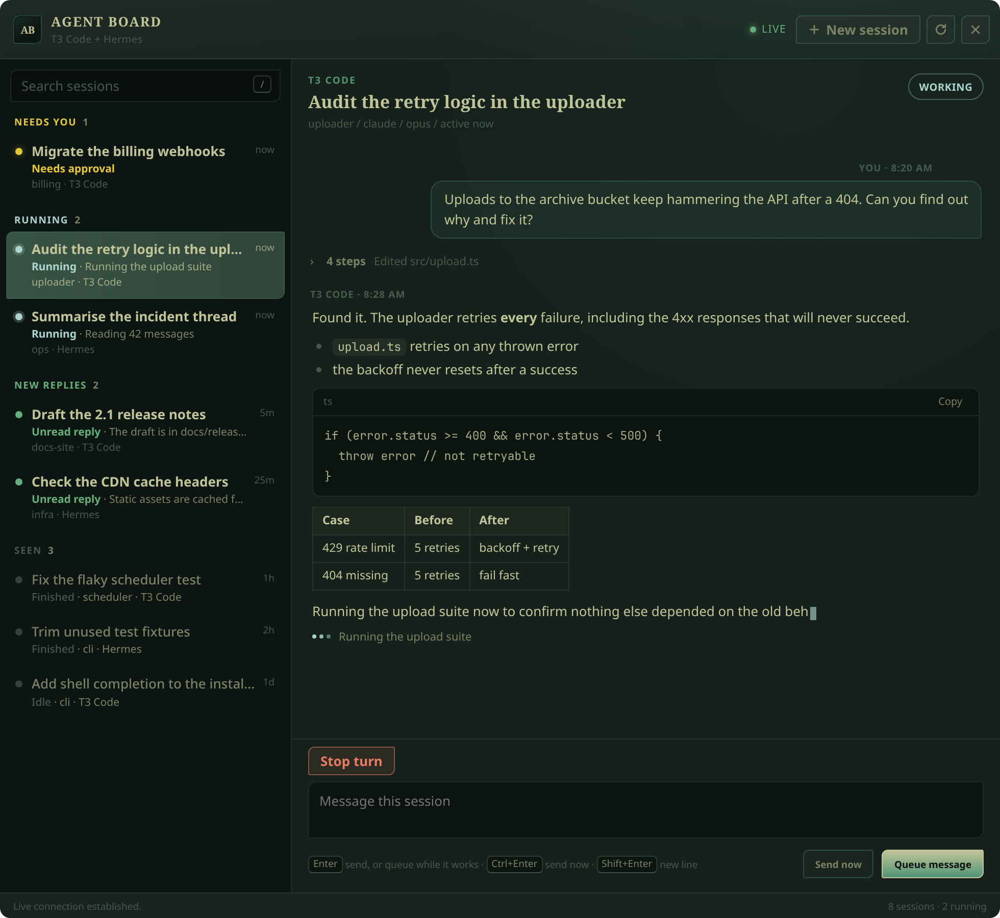

# Agent Board

One live desktop overlay and one local bridge for **T3 Code** and **Hermes**,
with a native World of Warcraft addon as a fallback. See what needs you, read
the conversation, reply, answer approvals and input requests, stop a turn, or
start a new T3 Code session without leaving or reloading the game.



## What it is

- The Electron overlay is the primary UI. It receives live state and sends
  actions over a private Unix socket owned by the bridge service.
- The overlay follows the active Omarchy theme live, using the same generated
  `t3code.json` palette as T3 Code. Theme changes repaint without a restart.
- One Python bridge watches Hermes and T3 Code behind provider adapters. Its
  service also auto-starts the overlay when WoW appears and hides it when WoW
  exits.
- The native addon remains available for users who prefer it, but WoW addons
  cannot open a socket or watch a file. Its data can only change on a UI reload,
  so it is explicitly a fallback rather than the live experience.
- The T3 adapter attaches to the T3 Code server that is already running. It does
  not start a second T3 Code instance or require a patched nightly release.

Use either provider or both. Rows are labeled `T3 Code` or `Hermes`, and actions
are enabled only when that provider supports them.

## Requirements

- Linux with a systemd user session
- World of Warcraft Classic, interface `16001`
- Python 3.10 or newer
- T3 Code and/or a local Hermes installation
- Node.js 24 or newer if T3 Code is enabled
- Electron 42+ or the Electron bundled with an existing desktop installation
- Git for the bootstrap installer; source checkouts only need Python

The bridge is tested on Linux. Windows and macOS bridge hosts are not verified.

## Install

For a managed installation:

```bash
curl -fsSL https://raw.githubusercontent.com/btsouth/agent-board/v0.2.4/install.sh | bash
```

The installer downloads the tagged release under
`~/.local/share/agent-board/app`, finds the WoW AddOns directory, installs
`AgentBoard`, starts one `agent-board.service`, and enables it for future logins.

From a source checkout:

```bash
git clone https://github.com/btsouth/agent-board.git
cd agent-board
./bin/agent-board setup
```

To select paths explicitly:

```bash
agent-board setup \
  --addon-dir "/path/to/World of Warcraft/_classic_beta_/Interface/AddOns" \
  --t3-home "$HOME/.t3" \
  --hermes-home "$HOME/.hermes"
```

`--t3-home` and `--hermes-home` are optional. At least one provider must exist.

## Test in game

1. Start World of Warcraft in **Windowed** or **Windowed Fullscreen** mode.
   Exclusive fullscreen can cover an external overlay.
2. The bridge detects the game and opens the Agent Board badge. Click the badge,
   or press `Super+Alt+C`, to toggle the board. Drag the badge by the dots on
   its left. Resize the board and it keeps that size.
3. Select a session, read the conversation, and reply directly. Press **New
   session** to choose a T3 Code project and start work. The project dropdown is
   themed by Omarchy, and **Add a project folder** opens the native folder picker
   and registers that folder as a T3 Code project.
4. No Sync and no UI reload are required for the overlay.

The native addon is still installed. If you choose to use it, `/agents` or
`/ag` opens its fallback board. Its **Sync** action is a deliberate UI reload;
automatic loading-screen sync and send-on-sync are disabled by default.

Sessions are grouped under **Needs you** (approvals and questions an agent is
blocked on), **Running**, **Just finished** (ended in the last half hour, or
unread from the last three hours) and **Earlier**. Replies render Markdown and tool calls show as expandable steps between
messages. Keys on the board: `/` search, `j`/`k` move, `N` new session, `E`
settle (T3 Code) or archive (Hermes), `Esc` back to the badge. Right-click a
session for the rest: mark read or unread, settle or archive, stop, and copy its
title or ID. In the composer,
`Enter` sends (or queues while the agent works), `Ctrl+Enter` sends right away
and `Shift+Enter` adds a line.

The board supports:

| Action | T3 Code | Hermes |
| --- | --- | --- |
| Reply to a session | Yes | Yes |
| Start a new session | Yes | No |
| Approve or decline | Yes | Yes, when the store exposes a request |
| Answer an input request | Yes | No |
| Stop the active turn | Yes | Yes, local backend only |
| Mark read | Yes | Yes, also in Hermes |
| Settle or unsettle | Yes | No |
| Archive | No (settle instead) | Yes |
| Open the optional desktop board on a session | Yes | Existing hand-off behavior |

## Why the overlay is primary

WoW addons run in a sandbox with no filesystem or network access. The client
only reads `Data.lua` when the UI loads and only flushes SavedVariables during a
UI reload. A fully live native addon is therefore not possible without external
help.

The overlay does not have those constraints. It talks to
`agent-board-live.sock`, served by the same bridge process that owns the T3 and
Hermes connections. State refreshes continuously, actions return immediately,
and a missed T3 event is reconciled against T3's own shell snapshot.

### Native addon fallback

WoW addons cannot watch an external process live. The bridge writes an atomic
`Data.lua` snapshot. The client reads that file and flushes `SavedVariables` only
during a UI reload, so **Sync is the boundary**:

1. The addon writes queued actions and a sync timestamp into SavedVariables.
2. The UI reloads so WoW flushes that file.
3. The bridge reads the outbox and dispatches each action.
4. The bridge publishes fresh provider state.
5. The next Sync loads the result.

The outbox is provider-neutral:

```text
seq|kind|provider|host|session|text
```

Actions are acknowledged in sequence. Malformed or torn input is rejected rather
than replayed, and a provider failure is surfaced instead of looking like an
empty "all clear" board. The live overlay uses a direct action path that does not
touch this acknowledgement watermark.

## Recording a demo

`agent-board demo` switches the running overlay to a fictional board, so a
screenshot or screen recording never shows your real sessions. An agent streams
a reply with tool steps, another waits for approval, and anything you do in the
board gets an answer.

```bash
agent-board demo             # Ctrl+C to go back to your real sessions
agent-board demo --autoplay  # drives itself: opens, approves, replies, collapses
agent-board demo --speed 2
agent-board demo --stop
```

## Operations

```bash
agent-board status
agent-board doctor
agent-board wow publish
agent-board wow inbox
systemctl --user status agent-board.service
journalctl --user -u agent-board.service -n 50 --no-pager
```

Update or remove automatic startup:

```bash
agent-board update
agent-board uninstall
```

Uninstall removes the managed service and launcher. It preserves the addon,
SavedVariables, provider data, runtime state, and backups.

Control the primary overlay:

```bash
agent-board overlay --mode board
agent-board toggle
agent-board toggle --mode board
agent-board show
agent-board hide
```

## Architecture

| Piece | Location | Responsibility |
| --- | --- | --- |
| Live overlay | `overlay/` | Primary interface: live sessions, conversations, replies, approvals, new sessions |
| Native addon | `addon/AgentBoard/` | Reload-based fallback UI and in-game keybinds |
| Bridge service | `agentboard/` | Snapshot publishing, outbox dispatch, acknowledgement, state |
| Hermes adapter | `agentboard/roster.py`, `agentboard/backend.py` | Read the Hermes store and submit replies |
| T3 adapter | `agentboard/t3.py`, `agentboard/providers/t3_provider.mjs` | Attach to the running T3 server over its local RPC socket |
| Live socket | `agentboard/live.py` | Warm state for the overlay and direct action dispatch |

There is exactly one addon, one bridge service, and one action protocol. Provider
specifics stay behind the adapter boundary; the addon does not need two bridges
or separate builds.

Remote Hermes hosts can be merged into the same board:

```bash
agent-board wow hosts add terra --ssh terra --hermes-home /home/bts/.hermes
agent-board wow hosts list
agent-board wow hosts test terra
```

Remote T3 Code servers are not supported yet.

## Development

```bash
make check
make lint
make package
make preview
```

`make check` covers the Lua addon, payload compatibility, hostile input,
provider routing, setup and rollback, updates, packaging, and service behavior.
The final UI geometry still needs a real client because the offline stub cannot
measure Blizzard's font renderer.

## Troubleshooting

- **Board says no snapshot:** run `agent-board setup`, restart WoW, then Sync.
- **T3 rows are offline:** confirm T3 Code is running and
  `agent-board doctor` reports Node 24+.
- **Hermes rows are unavailable:** confirm the configured Hermes store exists
  and is readable.
- **An action remains queued:** Sync again. The UI reload and the bridge poll are
  separate steps.
- **Service is unhealthy:** inspect
  `journalctl --user -u agent-board.service -n 50 --no-pager`.

## Status

Version `0.2.4` is a preview. The bridge and addon are tested together, but the
in-game layout and provider-specific approval/input flows should be exercised in
the target client after installation.
